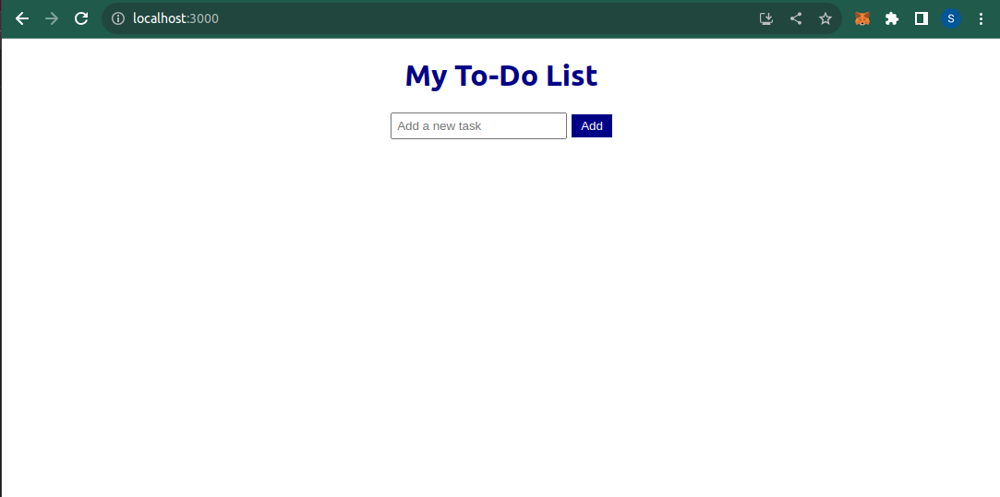

# TODO LIST APP Intermediate

Tutorial for understanding JSX and Virtual DOM

# Student Details

Sarthak Kaushik (101471600)

## For Running the project

In the project directory, run:

### `npm install`

### `npm start`

